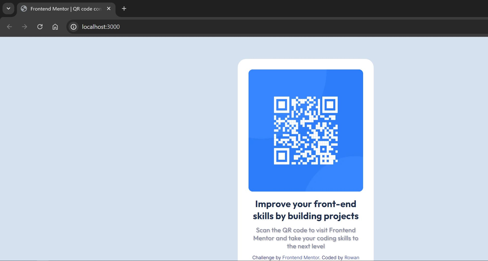
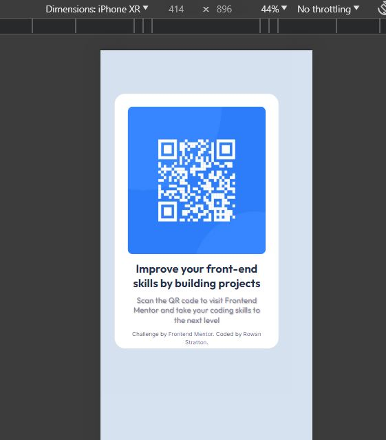

# Frontend Mentor - QR code component solution

This is a solution to the [QR code component challenge on Frontend Mentor](https://www.frontendmentor.io/challenges/qr-code-component-iux_sIO_H). Frontend Mentor challenges help you improve your coding skills by building realistic projects. 

## Table of contents

- [Overview](#overview)
  - [Screenshot](#screenshot)
  - [Links](#links)
- [My process](#my-process)
  - [Built with](#built-with)
  - [What I learned](#what-i-learned)
  - [Continued development](#continued-development)
  - [Useful resources](#useful-resources)
- [Author](#author)
- [Acknowledgments](#acknowledgments)

**Note: Delete this note and update the table of contents based on what sections you keep.**

## Overview

### Screenshot




### Links

- Solution URL: [Add solution URL here](https://github.com/roesorcerer/frontend-practice.git)
- Live Site URL: [Add live site URL here](https://your-live-site-url.com)

## My process

### Built with

- CSS custom properties
- Flexbox
- CSS Grid
- Mobile-first workflow
- [React](https://reactjs.org/) - JS library
- [Next.js](https://nextjs.org/) - React framework
- [Styled Components](https://styled-components.com/) - For styles

### What I learned

I was able to expierment with Next.js a little. Additionally, I opted to style this without Tailwind. Although Next has Tailwind I wanted to take advatange of this practice and work on my CSS classes. 

I created custom classes for each CSS element I used starting with the main container: 

```css
.container {
  /* Desktop */
  position: absolute;
  display: flex;
  width: 1440px;
  height: 800px;
  /* Light Grey */
  background: #d5e1ef;
}
```

The individual values are pulled directly from the Figma Design document. Many of the values you see are boxes sized from the master design document. 


### Continued development

This is a great baseline for practice frontend work. 

### Useful resources

- [Next.JS Docs](https://nextjs.org/docs) - Document for Next.Js reference and setup. 
- [CSS Refersher](https://www.w3schools.com/css/default.asp) - We all know this. Since I was ensuring I stepped away from Tailwind here. 
- [CSS Refersher](https://developer.mozilla.org/en-US/docs/Web/CSS) - More CSS 
- [React](https://react.dev/reference/react) - Frontend React Reference used to help me pick how I would start this. 


## Author


- Frontend Mentor - [@yourusername](https://www.frontendmentor.io/profile/yourusername)


## Acknowledgments

Matt for making me write all this by hand. :/


